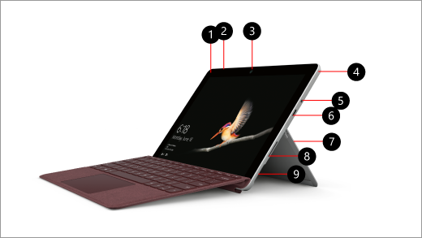
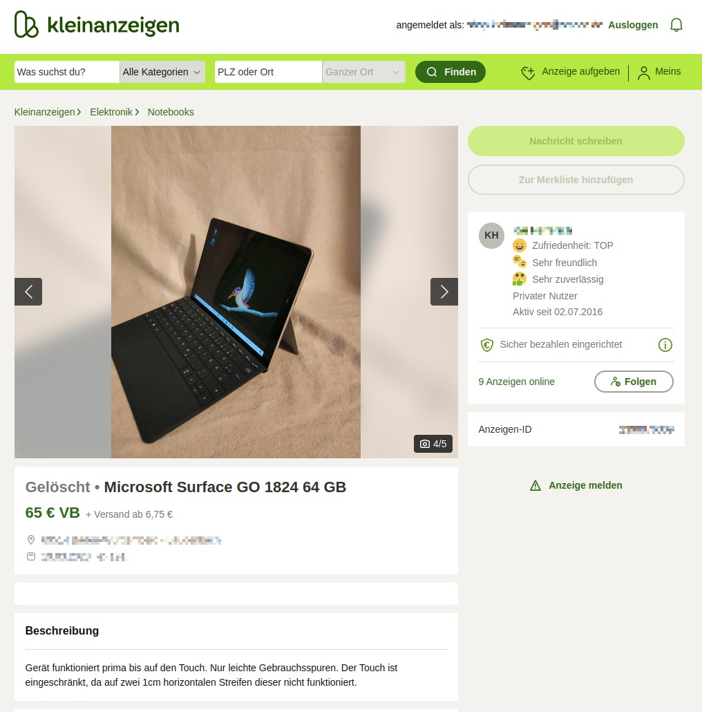

# How to use a Microsoft Surface as a Digital Photo Frame

## Idea / Requirements

I wanted to have a digital photo frame which fulfills the following requirements:
- Low cost, good quality, high resolution
- Able to import photos from an online photo album
- Remote administration / view possible
- Only rely on open source / self hosted software (no "cloud")
- "grandma"-proof, so it should only do one thing: show images. Everything else disabled.

So I did research and stumbled upon the Microsoft Surface Go (1st generation):



It features:
- A really good build quality, including a built-in stand
- A high resolution (1800x1200) at 10 inch screen size
- Standard X86 hardware which supports Linux
- 3 buttons (power, volume up/down)
- A magnetic charger (can also be charged via USB-C)
- A variety of sensors, including a brightness sensor

And to my surprise they are dirt cheap because you can find some with a (partially) broken touchscreen on Kleinanzeigen (German craigslist):



So this is a perfect match!

## Installation Manual

### Operating System

I installed openSUSE Leap (https://get.opensuse.org/leap/15.5/) with a minimal graphical Interface which is IceWM. I originally assumed it is an ARM CPU, but the default x86 64-bit image will boot. just copy it to an USB stick and boot the surface from it:

```
dd if=./openSUSE-Leap-15.5-NET-x86_64-Build491.1-Media.iso of=/dev/sda bs=1M
```

To boot from USB press and hold volume-down and then press the power button. More information here: https://support.microsoft.com/en-us/surface/boot-surface-from-a-usb-device-fe7a7323-8d1d-823d-be17-9aec89c4f9f5

When installing select "Generic Desktop" as "System Role" and make sure you enable X11 auto login for the user so it will boot directly into IceWM. Create a user called "user".


