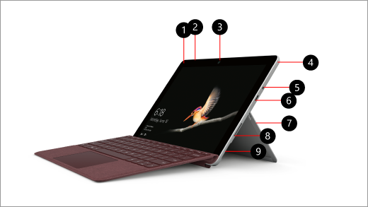
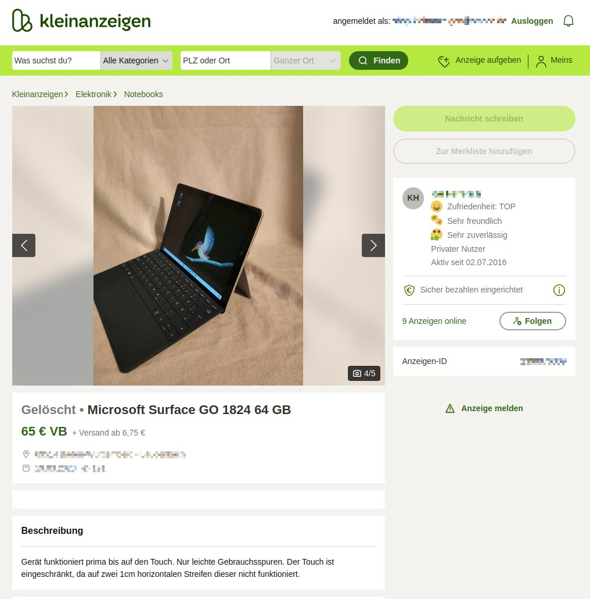

# How to use a Microsoft Surface as a Digital Photo Frame

## Idea / Requirements

I wanted to have a digital photo frame which fulfills the following requirements:
- Low cost, good quality, high resolution
- Able to import photos from an online photo album
- Remote administration / view possible
- Only rely on open source / self hosted software (no "cloud")

So I did research and stumbled upon the Microsoft Surface Go (1st generation):

It features:
- A really good build quality, including a built-in stand
- A high resolution (1800x1200) at 10 inch screen size
- Standard X86 hardware which supports Linux
- 3 buttons (power, volume up/down)
- A magnetic charger (can also be charged via USB-C)
- A variety of sensors, including a brightness sensor

And to my surprise they are dirt cheap because you can find some with a (partially) broken touchscreen on Kleinanzeigen (German craigslist):

So this is a perfect match!
